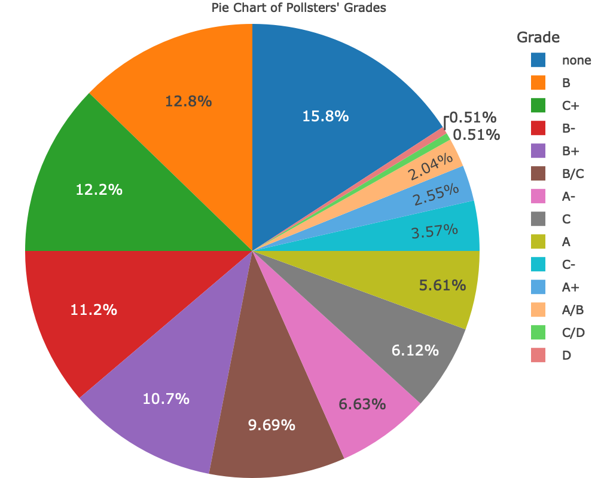
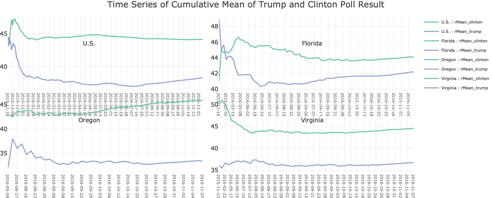
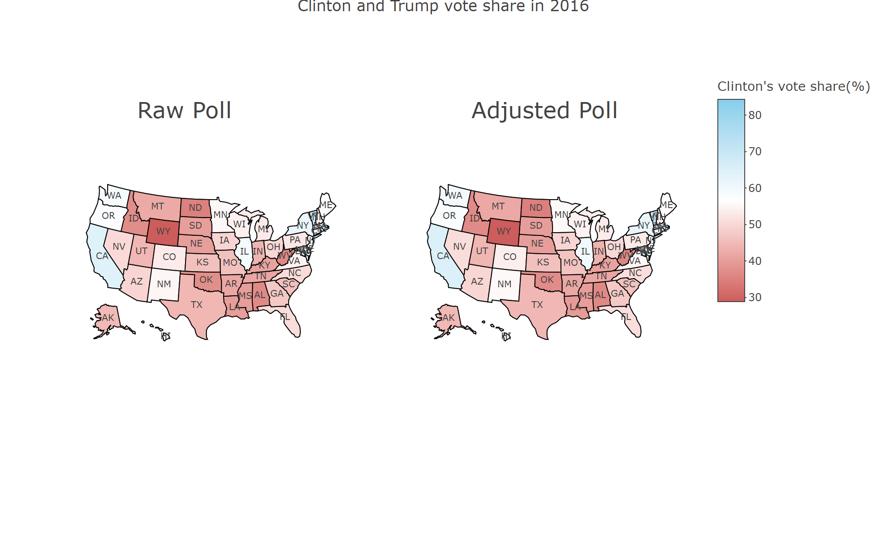

# Introduction
A data set of the 2016 US election polls was given. In this project we aim to understand the data structure by creating various visualizations.

First, we would like to give a brief introduction to the U.S. election system as it is crucial to understand the background of the data. Voters in each state vote to choose the President of the United States. The candidate who wins the majority of the votes will receive all the electoral votes in that state. Then the sum of the electoral votes in each state is calculated. The total number of electoral votes is 538. The candidate who wins half of the votes plus 1 will win and become the new President of the United States. Since each state has a different number of electoral votes, it is crucial for electors to win in several key states. The reason is that if a candidate wins a certain state, he will win all the electoral votes in that state. Texas, for example, counts for 38 electoral votes during the election, it is therefore a tight competition in states with more votes. 

Analysis on poll result can be very difficult due to the fact that carrying out a public opinion poll is generally difficult. The experimental design plays a profound rule in these surveys, as sometimes it is hard to achieve an unbiased sample. On the other hand, one might not be able to obtain the final result that can be compared with the poll result. Finally it can be very expensive to carry out a qualitative poll under budget constrains. However, election poll result is a desirable measurement we can study. Large institutions design the survey and gather public opinions. Moreover, we immediately know with high accuracy and details on who wins the election at the end. It is therefore worthy to analyze the poll results and make some inferences, perhaps even compare results between each election. Thus, we want to analyze some of the key factors given by our poll result data and compare with the actual election result for the candidate’s victory.

# Method
The data set was published by FiveThirtyEight to illustrate the reliability and quality of each pollster to which a letter grade ranging from A+ to D- was given. We first analyzed key individual variables in the data, then we sought to draw conclusions on the relationship between some of the key variables. To achieve this, we use various R packages to present the data set and to plot the graphs.

```{r, include=FALSE}
knitr::opts_chunk$set(echo = FALSE, warning = FALSE)
library(plotly)
library(tidyverse)
library(kableExtra)
library(maps)
library(htmlwidgets)
library(webshot)
```

# Section 1: Data Dictionary
```{r}
#load data set
ElectionPoll<-read.csv("polls_us_election_2016.csv", header = TRUE)
```

We first created a data variable definition table to give an initial understanding of the data. We formed the table by collecting each variable from the data, listed in the Variables column. We then looked at the size and the data type of each variable to understand its nature. An example consisting of a few variable values was given to illustrate what the variable might look like. We then calculated the number of unique and missing values in each variable. As one can see, there were a few variables with high percentage of missing values, for which we have discussed further in details in the subsequent sections. Finally, we gave a comment for each variable to briefly explains what it means and what it represents. The data dictionary is listed in Table 1:

```{r}
#create data variable definition
DataDict<-data.frame(
  Variables=colnames(ElectionPoll), Size=nrow(ElectionPoll), 
  Type=sapply(ElectionPoll, function(x) class(x)),
  Example=sapply(ElectionPoll, function(x) paste(as.character(head(unique(x),3)), collapse = ", ")),
  Number.Unique=sapply(ElectionPoll, function(x) length(unique(x))),
  Number.Missing=sapply(ElectionPoll, function(x) sum(is.na(x))),
  Comment=c("The name of the state (or national) where the election is held",
            "Start date of poll",
            "End date of poll",
            "Organization name that conducts or analyzes opinion polls",
            "Grade assigned by Fivethirtyeight to pollster",
            "Sample size of polls for each pollster",
            "Type of population being polled",
            "Poll Percentage for Hillary Clinton",
            "Poll Percentage for Donald Trump",
            "Poll Percentage for Gary Johnson",
            "Poll Percentage for Evan Mcmullin",
            "Adjusted percentage for Hillary Clinton",
            "Adjusted percentage for Donald Trump", 
            "Adjusted percentage for Gary Johnson",  
            "Adjusted percentage for Evan Mcmullin")
)

DataDict%>%remove_rownames()%>%kable(booktabs = TRUE,caption = "Data Variable Definition")%>%
  kable_styling(font_size=10, latex_options=c("striped","scale_down","hold_position"))%>%
  column_spec(4, width = "8em")%>%
  row_spec(0,bold=TRUE)

Jmiss<-sapply(ElectionPoll[, c("rawpoll_johnson", "adjpoll_johnson")], function(x) round(sum(is.na(x))/nrow(ElectionPoll)*100,2)%>% paste0("%") ) 
Jmc<-sapply(ElectionPoll[, c("rawpoll_mcmullin", "adjpoll_mcmullin")], function(x) round(sum(is.na(x))/nrow(ElectionPoll)*100,2)%>% paste0("%") ) 
```

Note that the poll results for Johnson and McMullin had lots of missing values. In particular, Johnson had `r Jmiss[1]` raw poll result and  `r Jmiss[2]` adjusted poll result missing, and McMullin had `r Jmc[1]` and `r Jmc[2]` missing. Due to the fact that these two candidate didn't make to the final election, and the percentage of missing values is too high to be considered in the analysis, we chose to ignore their data in some of the analysis. 

# Section 2: Variable Exploration
We first took an initial look at each variable.

The state variable consists of each state in the U.S., but it also contains the national value named "U.S." and some of other values like "":

```{r}
unique(ElectionPoll$state)
```

The startdate and enddate variables correspond to the dates on which the public opinion poll was initiated and finalized respectively. Individual pollster might start or end their poll at different date than other pollsters.

We then took a look at the grade variable. We noticed that there are 57 pollsters (almost 30% of the total number of pollsters) whose grades are missing in this data set. Although the grades were missing, we could not just omit them because there were data in other columns. For example:

```{r}
head(ElectionPoll[which(is.na(ElectionPoll$grade)==TRUE), ])
```

We suppose that there are two possible reasons for these missing data: one is that there are some errors of data in the original file; the other is that fivethirtyeight has not rated these pollsters yet. So we searched online and found a more detailed and authoritative file about the pollsters' grade from the fivethirtyeight website: https://projects.fivethirtyeight.com/pollster-ratings/.

According to the fivethirtyeight website, we found that 26 pollsters with no grade in the origin data set actually have the grades like "A/B", "B/C", "C/D", "B", "B-"; otherwise, the rest 31 pollsters without grades haven't been scored yet. Based on these information, we updated the "grade" column of the origin data set. We replace "NA" with the actual grades and none. The result is shown in Table 2:

```{r}
pollster_grade <- distinct(subset(ElectionPoll, select = c("pollster","grade"))) #Extract two columns:"pollster" and "grade" from the Electionpoll
pollster_grade$grade[is.na(pollster_grade$grade)] <- "none" #Replace NA in the "grade" column with none
condition1 <- pollster_grade$pollster %in% c("Associated Industries of Florida", "BK Strategies", "Baldwin Wallace University", "Bendixen & Amandi International", "Centre College", "Craciun Research", "Data Targeting", "Hickman Analytics", "HighGround", "Insights West", "Mercyhurst University", "Meredith College", "Ogden & Fry", "Praecones Analytica", "Saguaro Strategies", "Starboard Communications", "Strategic National", "Strategy Research", "University of Colorado") #Replace the right grades with none
pollster_grade$grade[condition1] <- "B/C"
condition2 <- pollster_grade$pollster %in% c("Data Orbital", "Echelon Insights", "Michigan State University", "Public Religion Research Institute")
pollster_grade$grade[condition2] <- "A/B"
condition3 <- pollster_grade$pollster %in% c("Morning Consult")
pollster_grade$grade[condition3] <- "B-"
condition4 <- pollster_grade$pollster %in% c("Remington")
pollster_grade$grade[condition4] <- "B"
condition5 <- pollster_grade$pollster %in% c("University of Wyoming")
pollster_grade$grade[condition5] <- "C/D"
A <- pollster_grade[pollster_grade$grade == "A/B" | pollster_grade$grade == "B/C" | pollster_grade$grade == "C/D" | pollster_grade$pollster == "Morning Consult" | pollster_grade$pollster == "Remington", ]
kable(A, format = "markdown", 
      caption = "Updating the missing data",
      align = c("l", "c", "c")) %>%
  kable_styling(full_width = FALSE)
```

Because some pollsters are repeated in different rows of the data set, so we want to verify that each pollster corresponds to only one kind of grade. The result is as follow:

```{r}
#Calculate the different grades corresponding to each pollster
grouped_data <- pollster_grade %>%
  group_by(pollster) %>%
  summarise(number_of_grades = n_distinct(grade))
unique_values <- unique(grouped_data$number_of_grades)
if (length(unique_values) == 1) {
  cat("the column of number_of_grades only contains one type of value:", unique_values, "\n")
} else {
  cat("the column of number_of_grades contains different types of values.\n")
}
```

After cleaning the missing values for the grade variable and checked its uniqueness for each pollster to make sure there was no error in data entry, we plotted a pie chart to gain initial understanding of the grade variable.

From the "Pie Chart of Pollsters' Grades" below, we could see that the unrated pollsters make up the largest percentage, about 15.8% of the total; pollsters with grades "B" and "C+" account for the second and third most, 12.8% and 12.2% respectively; "D" grade has the smallest percentage of pollsters, only about 0.51%. Besides, B-level grades, including "B+", "B" and "B-", are around 34.7%, almost one-third of the total; C-level and A-level grades are about 21.89% and 14.79% respectively. For those without explicit grades, whose grades are "A/B", "B/C" and "C/D", they account only for 12.24%, "B" grade pollsters make up the majority of this part especially, almost 9.69%.

```{r}
category_counts <- table(as.factor(pollster_grade$grade))
unique_levels <- levels(factor(pollster_grade$grade)) 
percentages <- (category_counts / sum(category_counts))*100 #calculate the percentages of different grades
A <- as.data.frame(percentages)#construct the data frame of two variables:"Var1"(grade) and "Freq"(percentages of grades)

piechart <- plot_ly(A, labels=~Var1, values=~Freq, type="pie")
piechart <- piechart %>% layout(title = "Pie Chart of Pollsters' Grades",
                                xaxis = list(showgrid = FALSE, zeroline = FALSE, showticklabels = FALSE),
                                yaxis = list(showgrid = FALSE, zeroline = FALSE, showticklabels = FALSE),
                                legend = list(title = list(text="Grade")))

saveWidget(widget = piechart, file = "./Figures/piechart.html")
shots<-webshot(url = "./Figures/piechart.html", file = "./Figures/piechart.png", delay = 1, zoom = 4, vheight = 500)
```



### plot for samplesize
We take a look at the distribution of the sample size with regards to the grade:

```{r, warning=FALSE}
GradeVsSize<-ElectionPoll%>%group_by(grade)%>%summarise(Size=sum(samplesize))

sampleDist<-ggplot(GradeVsSize, aes(x=grade, y=Size))+
  geom_bar(stat="identity")+labs(title="Distribution of Sample Size for Grades", x="Sample Size", y="Frequency")

ggplotly(sampleDist)
```

### plot for population


We now turn our attention to the actual poll rate for each candidate. Using the end date as the standard, we first drew a time series made of scatter plot of the raw poll rates of the four candidates over time.

```{r}
#Create frame contained time, rawpoll
start_time <- as.POSIXct(ElectionPoll$startdate)
end_time <- as.POSIXct(ElectionPoll$enddate)
prop_raw_clinton <- ElectionPoll$rawpoll_clinton
prop_raw_trump <- ElectionPoll$rawpoll_trump
prop_raw_johnson <- ElectionPoll$rawpoll_johnson
prop_raw_mcmullin <- ElectionPoll$rawpoll_mcmullin

poll_by_time <- data.frame( 
  start_time = start_time,
  end_time = end_time,
  clinton = prop_raw_clinton,
  trump = prop_raw_trump,
  johnson = prop_raw_johnson,
  mcmullin = prop_raw_mcmullin
)

# Order with increasing end_date
poll_by_time <- poll_by_time[order(poll_by_time$end_time, decreasing = FALSE),]
```

```{r, warning=FALSE, fig.cap = "Raw Poll Proportion by Time."}
# Plot trend with all four candidates's uncleaned data
g_2 <- ggplot(poll_by_time, aes(x = end_time)) +
  geom_point(aes(y = prop_raw_clinton, color = "Clinton"),size = 1, alpha = 0.3) +
  geom_point(aes(y = prop_raw_trump, color = "Trump"), size = 1, alpha = 0.3) +
  geom_point(aes(y = prop_raw_johnson, color = "Johnson"), size = 1, alpha = 0.3) +
  geom_point(aes(y = prop_raw_mcmullin, color = "Mcmullin"), size = 1, alpha = 0.3) +
  labs(x = "Date", y = "Proportion of rawpoll (%)", 
       title = "Raw Poll Proportion by Time", 
       subtitle = "Clinton vs. Trump vs. Johnson vs. Mcmullin") +
  scale_color_manual(values = c("Clinton" = "blue", "Trump" = "red", "Johnson" = "green", "Mcmullin" = "yellow")) +
  scale_x_datetime(date_breaks = "2 month") +
  theme(axis.text.x = element_text(angle = 50, size = 7, vjust = 0.5)) + 
  theme(axis.title.x = element_text(size = 9, vjust = 0),
        axis.title.y = element_text(size = 9, vjust = 3)) +
  theme(plot.title = element_text(size = 12, face = "bold", 
                                  margin = margin(0, 0, 0, 0))) + 
  theme(legend.title = element_blank()) +
  theme(legend.position = "bottom")
print(g_2)
```

Figure 1 indicates that Clinton and Trump’s approval ratings are significantly higher than those of Johnson and Mcmullin at the overall level. Another interesting demonstration is the divergence of support as the vote draws to a close. This shows that as the voting deadline approaches, people's intentions are more inclined to one of Clinton or Trump. Voting is also more polarized. A low poll rate for one candidate also implies that other candidates may have received high poll rates. This creates differences in each state. Therefore, we tried to compare each candidate's poll result in each state. 

We processed the metadata by counting the polls received by each of the four candidates in each state. This result was easier to obtain by multiplying the given sample size and the proportion. Regardless of the various pollsters, we combined the number of polls for each candidate received in each state although the polls may come from different pollsters. In this case, we treated NA as 0.

```{r}
#Create frame contained state, poll number for each candidate
states <- ElectionPoll$state
prop_raw_clinton <- ElectionPoll$rawpoll_clinton
prop_raw_trump <- ElectionPoll$rawpoll_trump
prop_raw_johnson <- ElectionPoll$rawpoll_johnson
prop_raw_mcmullin <- ElectionPoll$rawpoll_mcmullin
size <- ElectionPoll$samplesize

poll_by_state <- data.frame(
  state = states,
  prop_clinton = prop_raw_clinton,
  prop_trump = prop_raw_trump,
  prop_johnson = prop_raw_johnson,
  prop_mcmullin = prop_raw_mcmullin,
  size = size,
  NumVote_clinton = size * (prop_raw_clinton/100),
  NumVote_trump = size * (prop_raw_trump/100),
  NumVote_johnson = size * (prop_raw_johnson/100),
  NumVote_mcmullin = size * (prop_raw_mcmullin/100)
)

poll_by_state[is.na(poll_by_state)] <- 0

NumVote_State <- cbind(poll_by_state$state, poll_by_state$NumVote_clinton, 
                       poll_by_state$NumVote_trump, poll_by_state$NumVote_johnson, 
                       poll_by_state$NumVote_mcmullin)
colnames(NumVote_State) <- c("state","Clinton", "Trump", "Johnson", "Mcmullin")

NumVoteState <- as.data.frame(NumVote_State) %>%
  pivot_longer(cols = -state,
               names_to = "candidate",
               values_to = "PollNumber")
NumVoteState$PollNumber <- as.numeric(NumVoteState$PollNumber)
```

The visualization of the poll proportion of the four candidates in each state was presented below:

```{r, fig.cap = "Poll Percentage by States."}
g_11 <- ggplot(data = NumVoteState, mapping = aes( x = state, fill = candidate)) +
  geom_col(aes(y = PollNumber),position='fill') +
  labs(x = "State", y = "Percentage of Polls", 
       title = "Poll Percentage by States") +
  scale_fill_manual(values=c("Clinton" = "blue", "Trump" = "red", 
                             "Johnson" = "green", "Mcmullin" = "yellow")) +
  theme(axis.text.x = element_text(angle = 50, size = 6, vjust = 0.5)) + 
  theme(axis.title.x = element_text(size = 9, vjust = 0),
        axis.title.y = element_text(size = 9, vjust = 3)) + 
  theme(plot.title = element_text(size = 12, face = "bold", 
                                  margin = margin(0, 0, 0, 0))) +
  theme(legend.position = "bottom")
print(g_11)
```

Figure 2 shows the poll proportions of the four candidates in each state distinguished by colors. We can clearly observe which candidate is likely to win all the electoral votes in each state, which is helpful in estimating the outcome of the presidential election. From the chart above, we conclude that Clinton and Trump are clearly ahead of Johnson and Mcmullin. Furthermore, Clinton is clearly ahead of Trump in California, DC, Hawaii, Illinois, Maryland, Massachusetts, New Jersey, New York, Oregon, Rhode Island, Vermont, and Washington. Another side, in Alabama, Alaska, Idaho, Indiana, Iowa, Kansas, Kentucky, Louisiana, Mississippi, Missouri, Montana, Nebraska, North Dakota, Ohio, Oklahoma, South Carolina, South Dakota, Tennessee, Texas, Utah, West Virginia, Wyoming, Trump clearly leads Clinton. This helps us tally who would win all of the state's electoral votes.

We now look at the time series of the adjusted poll proportion:

```{r, fig.cap = "Adjusted Poll Percentage by States"}
#Create frame contained time, rawpoll
poll_by_time <- ElectionPoll%>%transmute(end_time=as.POSIXct(enddate),
                                         clinton=adjpoll_clinton, trump=adjpoll_trump, johnson=adjpoll_johnson, mcmullin=adjpoll_mcmullin )%>%arrange(end_time)

# Plot trend with all four candidates's uncleaned data
g_1 <- ggplot(poll_by_time, aes(x = end_time)) +
  geom_line(aes(y = clinton, color = "Clinton"), alpha = 0.6) +
  geom_line(aes(y = trump, color = "Trump"), alpha = 0.6) +
  geom_line(aes(y = johnson, color = "Johnson"), alpha = 0.6) +
  geom_line(aes(y = mcmullin, color = "Mcmullin"), alpha = 0.6) +
  labs(x = "Date", y = "Proportion of rawpoll (%)", 
       title = "Raw Poll Proportion by Time",
       subtitle = "Clinton vs. Trump vs. Johnson vs. Mcmullin",
       caption = "Data: poll_by_time (with missing values)") +
  scale_color_manual(values = c("Clinton" = "blue", "Trump" = "red", "Johnson" = "green", "Mcmullin" = "yellow")) +
  scale_x_datetime(date_breaks = "2 month") +
  theme(axis.text.x = element_text(angle = 50, size = 7, vjust = 0.5)) + 
  theme(axis.title.x = element_text(size = 9, vjust = 0),
        axis.title.y = element_text(size = 9, vjust = 3)) +
  theme(plot.title = element_text(size = 12, face = "bold", 
                                  margin = margin(0, 0, 0, 0))) +
  theme(legend.title = element_blank()) +
  theme(legend.position = "bottom")
print(g_1)
```

We immediately noticed that some of the poll rate for Johnson fell below zero. 


Since the final two candidates in Election 2016 are Clinton and Trump, we plotted box plots of the difference of their poll results, one for the raw poll and one for the adjusted poll. 

```{r}
ElectionPoll$grade<-replace_na(ElectionPoll$grade, "D-")

fig1<-ElectionPoll%>%mutate(Diffs=rawpoll_clinton - rawpoll_trump)%>%plot_ly(y=~Diffs, color = ~grade, type = "box")%>%layout()
fig2<-ElectionPoll%>%mutate(Diffs=adjpoll_clinton - adjpoll_trump)%>%plot_ly(y=~Diffs, color = ~grade, type = "box",showlegend=FALSE)

boxchart<-subplot(fig1, fig2, nrows = 2, shareX = TRUE)%>%
  layout(yaxis=list(title="Raw Poll Difference"),
         yaxis2=list(title="Adjusted Poll Difference"),
         title="Difference between poll_Clinton and poll_Trump",
         legend = list(title = list(text="Grade")))

saveWidget(widget = boxchart, file = "./Figures/boxchart.html")
shots<-webshot(url = "./Figures/boxchart.html", file = "./Figures/boxchart.png", delay = 1, zoom = 4, vheight = 500)
```


We saw that there's little difference between the distribution of the raw and the adjusted data. However, the mean of each grade of the adjusted poll result was a little closer to zero than that of the raw poll result. This indicated that the adjustment that FiveThirtyEight made was an improvement because the raw poll difference of each grade was mostly above zero, which clearly showed that the poll result was more in favour of Clinton yet Trump was the final winner of the election.

However, due to the fact that FiveThirtyEight's adjustment to the poll result yields negative values, we think it is therefore unreasonable to do such adjustment. It gives the reader a difficulty in interpreting this adjustment.

Finally we plot the cumulative mean of the raw poll result for the final two candidates, Trump and Clinton. We selected the Clinton and Trump polls and ignore the other candidates' poll since the other candidates are polling far behind Clinton and Trump.

```{r}
#Calculate cumulative mean
rMean<-function(df){
  rMeans<-df%>%group_by(enddate) %>%
    summarize(mean_trump = mean(rawpoll_trump), mean_clinton=mean(rawpoll_clinton))%>%
    transmute(enddate=enddate, rMean_trump=cummean(mean_trump), rMean_clinton=cummean(mean_clinton))%>%
    gather(key="Candidate", value="val", rMean_trump:rMean_clinton)
  return(data.frame(rMeans))
}
#Plot cumulative mean for a State
PlotCMean<-function(state){
  p<-plot_ly(Navg_lst[[state]], x=~enddate, y=~val, color=~Candidate, name = ~paste(state, ":", Candidate))%>%add_lines()%>%
    layout(title="plot",
           xaxis=list(tickfont = list(size = 8)),
           legend = list(font=list(size = 8))
    )
  return(p)
}
#Clean the data
CMeanData<-ElectionPoll
CMeanData[which(CMeanData$state=="Maine CD-1"),"state"]<-"Maine"
CMeanData[which(CMeanData$state=="Maine CD-2"),"state"]<-"Maine"
CMeanData[which(CMeanData$state=="Nebraska CD-1"),"state"]<-"Nebraska"
CMeanData[which(CMeanData$state=="Nebraska CD-2"),"state"]<-"Nebraska"
CMeanData[which(CMeanData$state=="Nebraska CD-3"),"state"]<-"Nebraska"
#apply rMean to all states
Navg_lst<-CMeanData%>%select(state, enddate, rawpoll_trump, rawpoll_clinton)%>%arrange(.by=enddate, decreasing=FALSE)%>%split(.$state)
Navg_lst<-purrr::map(Navg_lst, rMean)
#sample a few states
set.seed(100)
state_i<-sample(names(Navg_lst), size=3, replace = FALSE)
#make subplot
cMeanchart<-subplot(PlotCMean("U.S."),PlotCMean(state_i[1]),PlotCMean(state_i[2]),PlotCMean(state_i[3]),nrows = 2)%>%
  layout(title="Time Series of Cumulative Mean of Trump and Clinton Poll Result",
         annotations=list( 
           list( 
             x = 0.2,  
             y = 0.85,  
             text = "U.S.", 
             font=list(size = 12),
             xref = "paper",  
             yref = "paper",  
             xanchor = "center",  
             showarrow = FALSE 
           ),  
           list( 
             x = 0.75,  
             y = 0.85,  
             text = state_i[1],  
             font=list(size = 12),
             xref = "paper",  
             yref = "paper",  
             xanchor = "center",
             showarrow = FALSE 
           ),
           list( 
             x = 0.2,  
             y = 0.3,  
             text = state_i[2],  
             font=list(size = 12),
             xref = "paper",  
             yref = "paper",  
             xanchor = "center",
             showarrow = FALSE 
           ),
           list( 
             x = 0.75,  
             y = 0.3,  
             text = state_i[3],  
             font=list(size = 12),
             xref = "paper",  
             yref = "paper",  
             xanchor = "center",
             showarrow = FALSE 
           )
         ),
         showlegend = TRUE
  )
saveWidget(widget = cMeanchart, file = "./Figures/cMeanchart.html") 
shots<-webshot(url = "./Figures/cMeanchart.html", file = "./Figures/cMeanchart.png", delay = 1, zoom = 4, vheight = 600)
```



From the plot above we see that the overal national poll result indicates that Clinton should be the winner of the election. However, some of the individual states resulted the opposite conclusion. It it therefore hard to tell which candidate is leading by examining the individual state poll result.

To make state-by-state polling results more visible, we've reflected the candidates' polling shares on a map of the United States. In the contour plot below, blue indicates that Clinton is polling proportionally greater than Trump, and red indicates that Trump is polling proportionally greater than Clinton. The darker the color, the more overwhelming the proportions. For states that are nearly white, the margin of victory is nearly half between Trump and Clinton.

```{r}
#fill a matrix
ElectionPoll$state<-toupper(ElectionPoll$state)
state_poll<- ElectionPoll %>%
  group_by(state) %>%
  summarise(rawpoll_clinton = mean(rawpoll_clinton), rawpoll_trump = mean(rawpoll_trump),adjpoll_clinton = mean(adjpoll_clinton), adjpoll_trump = mean(adjpoll_trump))
#delete useless data
state_poll<-state_poll[-50,]
state_poll<-state_poll[-c(31:33),]
state_poll<-state_poll[-c(21:22),]
colnames(state_poll)<-c("State","rawpoll_clinton","rawpoll_trump","adjpoll_clinton","adjpoll_trump","percent_rawpoll_clinton","percent_adjpoll_clinton")

state_rawpoll<-data.frame(state_poll[,1:3])
state_adjpoll<-data.frame(state_poll[,1],state_poll[,4:5])
#add percent
state_rawpoll$percent_rawpoll_clinton<-100*state_poll$rawpoll_clinton/(state_poll$rawpoll_clinton+state_poll$rawpoll_trump)
state_adjpoll$percent_adjpoll_clinton<-100*state_poll$adjpoll_clinton/(state_poll$adjpoll_clinton+state_poll$adjpoll_trump)
```

```{r}
#get map data:
df <- read.csv("https://raw.githubusercontent.com/plotly/datasets/master/us-cities-top-1k.csv")
df<-distinct(df,State, .keep_all = TRUE)
df$State<-toupper(df$State)
df<-df[,-3]
df<-df[,-1]
states_map <- map_data(map = "state",region =df$State)

#get mean longitude and latitude
region.lab.data <- states_map %>%
  group_by(region) %>%
  summarise(lon = mean(long), lat = mean(lat))
region.lab.data$region<-toupper(region.lab.data$region)

region.lab.data[which(region.lab.data$region=="HAWAII"),]<-df[which(df$State=="HAWAII"),]
region.lab.data[which(region.lab.data$region=="ALASKA"),]<-df[which(df$State=="ALASKA"),]
colnames(region.lab.data)<-c("State","lat","lon")

df1<-merge(state_rawpoll,df, by.x = "State")
df_1<-merge(state_adjpoll,df, by.x = "State")

#add code
df2<-read.csv("https://raw.githubusercontent.com/plotly/datasets/master/2011_us_ag_exports.csv")
df2<-distinct(df2,state, .keep_all = TRUE)
df2$state<-toupper(df2$state)
df2<-df2[, 1:2]
colnames(df2)<-c("Code", "State")
df2<-rbind(df2, data.frame(Code="DC", State="DISTRICT OF COLUMBIA"))

df3<-merge(df1, df2, by.x = "State")
df_3<-merge(df_1, df2, by.x = "State")

#choropleth plot
g <- list(
  scope = 'usa',
  projection = list(type = 'albers usa')
)

mapchart1<-plot_geo(df3, locationmode = 'USA-states')%>% 
  add_trace(z = ~percent_rawpoll_clinton, locations = ~Code, color =~percent_rawpoll_clinton, colors=c('indianred','white','skyblue'),
            colorbar=list(limits = c(0, 100),title = "Clinton's vote share(%)",x = 1, y = 0.9))%>%
  add_trace(type = "scattergeo", locationmode = 'USA-states', locations = ~Code, 
            text = ~Code, mode = "text", textfont = list(size = 10))%>%
  layout(geo = g)


#adjpoll
mapchart2<-plot_geo(df_3, locationmode = 'USA-states')%>% 
  add_trace(z = ~percent_adjpoll_clinton, locations = ~Code, color =~percent_adjpoll_clinton, colors=c('indianred','white','skyblue'),showscale=FALSE)%>%
  add_trace(type = "scattergeo", locationmode = 'USA-states', locations = ~Code, 
            text = ~Code, mode = "text", textfont = list(size = 10))%>%
  layout(geo = g)

mapchart<-subplot(mapchart1, mapchart2)%>%
  layout(title = 'Clinton and Trump vote share in 2016',
         annotations=list( 
           list( 
             x = 0.2,  
             y = 0.85,  
             text = "Raw Poll", 
             font=list(size = 25),
             xref = "paper",  
             yref = "paper",  
             xanchor = "center",  
             showarrow = FALSE 
           ),  
           list( 
             x = 0.75,  
             y = 0.85,  
             text = "Adjusted Poll",  
             font=list(size = 25),
             xref = "paper",  
             yref = "paper",  
             xanchor = "center",
             showarrow = FALSE 
           )), showlegend=FALSE)


saveWidget(widget = mapchart, file = "./Figures/mapchart.html") 
shots<-webshot(url = "./Figures/mapchart.html", file = "./Figures/mapchart.png", delay = 3, zoom = 2, vheight = 600)
```



We obtained the final election result from https://www.nytimes.com/elections/2016/results/president and compared it with our poll prediction result:

```{r}
#election result in the end
electionresult<-read.csv("electionresult.csv")
electionresult$State<-toupper(electionresult$State)
df_4<-merge(df_3,electionresult,by.x="State")%>%mutate(bin=ifelse(Result=="C", 0, 100))

mapchart3<-plot_geo(df_4, locationmode = 'USA-states')%>% 
  add_trace(z = ~bin, locations = ~Code, color =~bin, colors=c("skyblue", 'white', 'red'),
            colorbar=list(limits = c(0, 100),title = "Trump wins in this state",x = 1, y = 0.9))%>%
  add_trace(type = "scattergeo", locationmode = 'USA-states', locations = ~Code, 
            text = ~Number, mode = "text",textfont = list(size = 10))%>%
  layout(geo = g)%>%
  layout(title = '2016 Presidential Election Results')

saveWidget(widget = mapchart3, file = "./Figures/mapchart3.html") 
shots<-webshot(url = "./Figures/mapchart3.html", file = "./Figures/mapchart3.png", delay = 3, zoom = 2, vheight = 600)
```


# Discussion

# Conclusion
